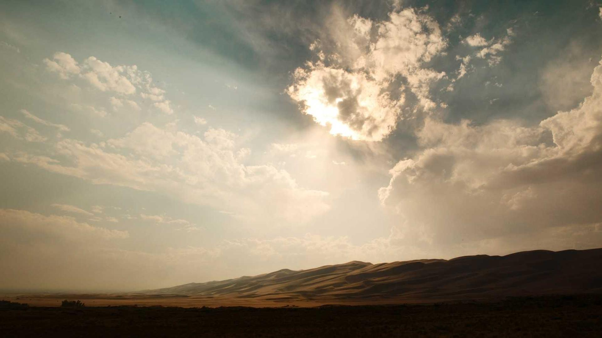
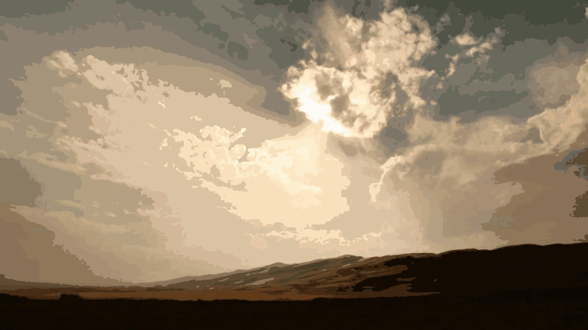
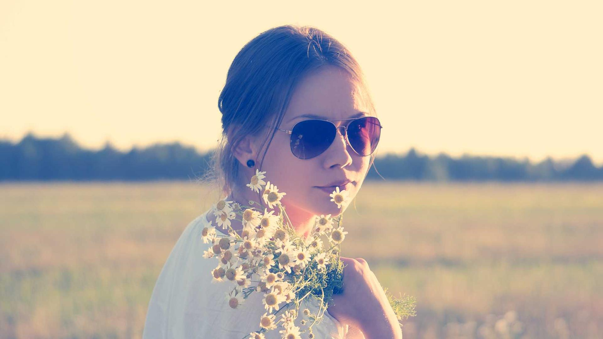
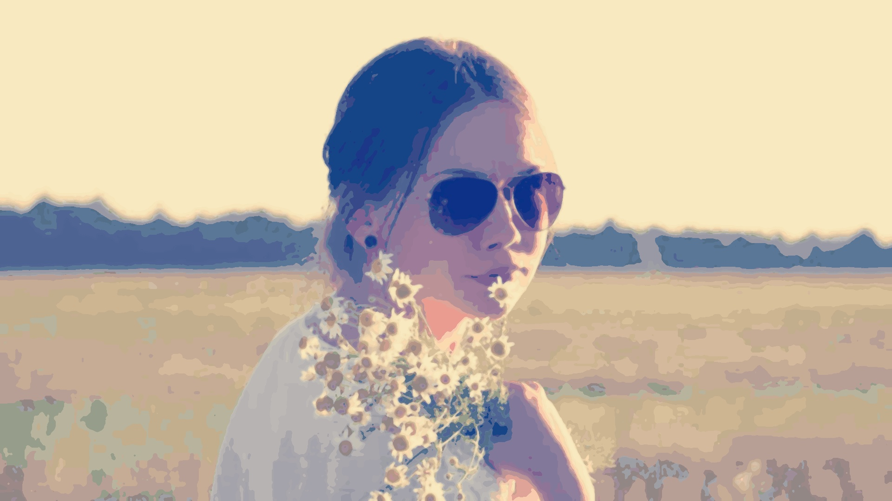
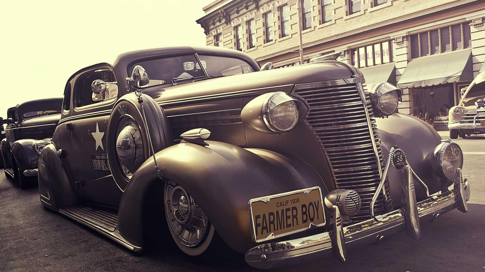
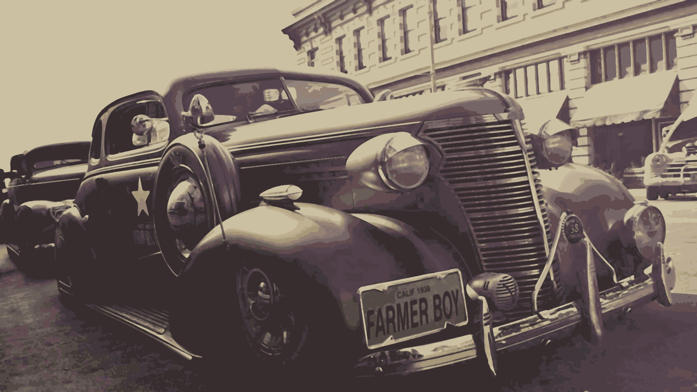
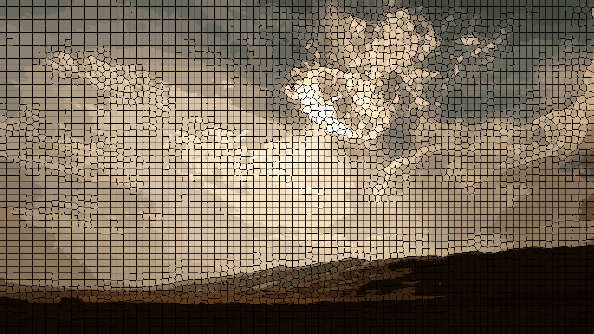
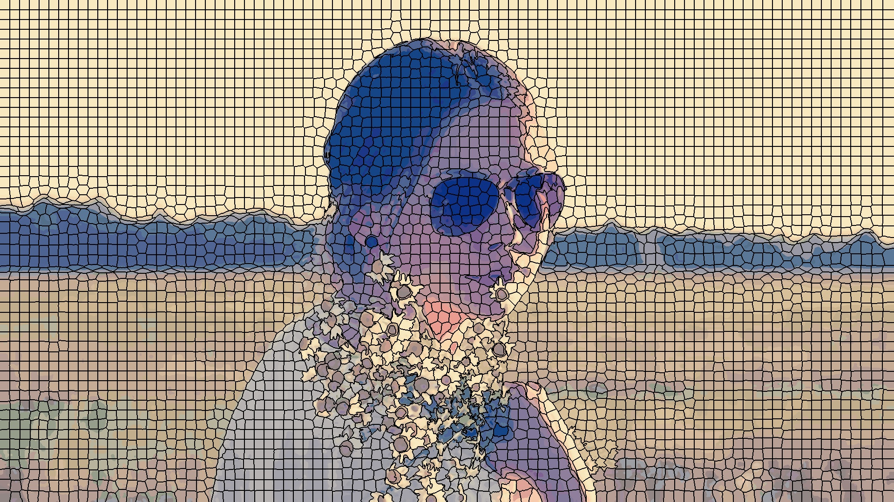
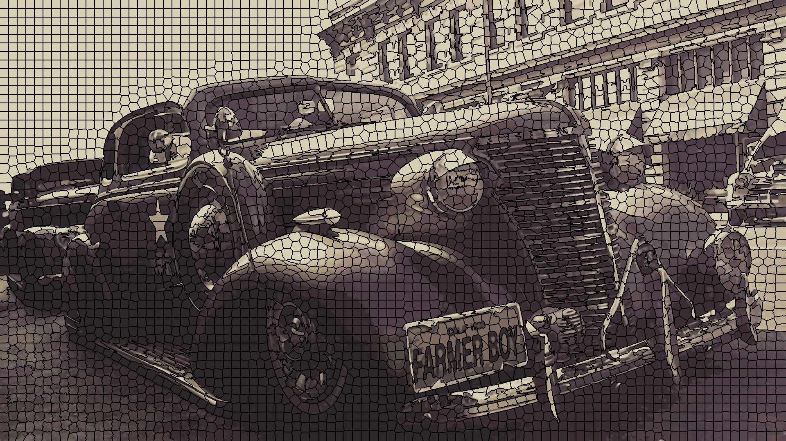

# SLICPosterizer

_Fast artistic posterization with SLIC superpixels._

`SLICPosterizer` is a Python tool for artistic image posterization that transforms photographs into stylized artwork with reduced color palettes. It provides both a command-line interface and Python API for fine control over colors, edges, blur, and segmentation.

The program is inspired by [PosterChild](https://github.com/tedchao/PosterChild), although this implementation is my own. The primary difference is that in `PosterChild` the authors use `KMeans` from [scikit-learn](https://scikit-learn.org/stable/modules/generated/sklearn.cluster.KMeans.html) as well as [SciPy ConvexHull](https://docs.scipy.org/doc/scipy/reference/generated/scipy.spatial.ConvexHull.html). While their approach offers better visual results, I found the use of these algorithms (in particular KMeans) very slow on my computer. 

The result is a faster posterization engine based entirely on [SLIC](https://www.epfl.ch/labs/ivrl/research/slic-superpixels/) superpixels. It works because SLIC itself is also a clustering algorithm, like KMeans, but optimized for image segmentation. Instead of clustering pixels based on color similarity, SLIC creates clusters based both on color similarity _and_ spatial proximity.

This implementation also streamlines dependencies and uses only the necessary imports to function and is provided as a single file for ease of use.

---

## Table of Contents

- [Features](#features)
- [Examples](#examples)
- [Installation](#installation)
- [Usage](#usage)
  - [CLI](#cli)
  - [Python API](#python-api)
- [License](#license)
- [Author](#author)
- [Acknowledgments](#acknowledgments)

---

## Features

- SLIC superpixel segmentation with adjustable compactness and count  
- Color palette optimization and posterization  
- Edge preservation with threshold controls  
- Optional overlay of superpixel boundaries  
- Command-line usage or import as a Python module  

---

## Examples

These images are taken from [Lorem Picsum](https://picsum.photos). Thank you to the developers for such a useful service! Note: for this service, `curl` must be used with `-L` to follow redirects.

Original | Posterized | Command
:------------------------------:|:----------------------------------------------------:|:--------:
 |  | `curl -L https://picsum.photos/id/222/1920/1080 \| slicposterizer curl_test.jpg`
 |  | `slicposterizer person.jpeg person_posterized.jpeg`
 |  | `uv run slicposterizer.py examples/car.jpeg examples/car_posterized.png -c 24`

You can also see the superpixel overlays with the `--overlay` option:

Landscape | Person | Car
:---:|:---:|:---:
 |  | 

---

## Installation

**Requirements:** Python 3.10+ (tested on Linux; Windows and macOS support should work but is untested)  

    "numpy>=1.26.4",
    "opencv-python>=4.11.0.86",
    "pillow>=11.3.0",
    "scikit-image>=0.25.2",
    "scipy>=1.16.1",

You can use the package either:

- **Directly by running the script file**, or  
- **By building and installing locally** via [uv](https://uv.run/):

```bash
uv build
uv pip install -e .
````

> **Note:** This package is not yet published on PyPI.

---

## Usage

### Quick start

```bash
slicposterizer input.jpg output.jpg -c 32 -S 3000 --overlay
```

---

### CLI

Run the CLI tool with:

```bash
slicposterizer input.jpg output.jpg [options]
```

Or pipe to it:

```bash
curl -L https://picsum.photos/id/222/1920/1080 | slicposterizer curl_test.jpg [options]
```

**Full CLI options:**

```
usage: slicposterizer [-h] [-m MIXING] [-p PALETTE] [-c COLORS] [-S SUPERPIXELS]
                      [--compactness COMPACTNESS] [-b BLUR] [-e EDGE_THRESHOLD]
                      [-d DOWNSAMPLE] [--no-edge-preserve] [--detail-blend DETAIL_BLEND]
                      [--quality QUALITY] [-s [1-10]] [--overlay]
                      input output

SLIC Posterizer - SLIC-Based Artistic Posterization

positional arguments:
  input                 Input image path (default: None)
  output                Output posterized image path (default: None)

options:
  -h, --help            show this help message and exit
  -c COLORS, --colors COLORS
                        Number of colors in palette (default: 64)
  -b BLUR, --blur BLUR  Blur radius for smoothing (default: 1)
  -s [1-10], --smoothing [1-10]
                        Smoothing strength level (1-10) (default: 3)
  -S SUPERPIXELS, --superpixels SUPERPIXELS
                        Number of superpixels (default: 4500)
  --compactness COMPACTNESS
                        SLIC superpixel compactness parameter (default: 15.0)
  --overlay             Overlay superpixel boundaries on the final image (default: False)
  -m MIXING, --mixing MIXING
                        Output prefix for additive mixing layers (default: None)
  -p PALETTE, --palette PALETTE
                        Output path for palette swatch (default: None)
  -e EDGE_THRESHOLD, --edge-threshold EDGE_THRESHOLD
                        Edge detection threshold (default: 0.1)
  -d DOWNSAMPLE, --downsample DOWNSAMPLE
                        Downsample factor (>=1) (default: 1)
  --detail-blend DETAIL_BLEND
                        Blend factor for detail preservation (default: 0.1)
  --quality QUALITY     JPEG quality (if saving JPEG) (default: 95)
  --no-edge-preserve    Disable edge preservation (default: False)
  --strict-size MAX_DIM
                        Resize longest image dimension to this value, keeping aspect ratio (e.g. 1920) (default: None)
```

---

### Python API

You can use the posterizer programmatically by importing `posterize`:

```python
from slicposterizer import posterize

posterize(
    input_path="input.jpg",
    output_path="output.jpg",
    num_colors=64,
    num_superpixels=4500,
    blur_radius=1.0,
    edge_threshold=0.1,
    preserve_edges=True,
    overlay_superpixels=False,
)
```

Or create a reusable `SLICPosterizer` instance:

```python
from slicposterizer import SLICPosterizer

posterizer = SLICPosterizer(
    num_colors=64,
    blur_radius=1.0,
    edge_threshold=0.1,
    downsample_factor=1,
    preserve_edges=True,
    num_superpixels=4500,
    superpixel_compactness=15.0,
    detail_blend_strength=0.1,
    smoothing=3,
    overlay_superpixels=False,
)

posterizer.posterize(
    input_path="input.jpg",
    output_path="output.jpg",
    palette_path=None,
    mixing_prefix=None,
    quality=95,
)
```

---

## License

This project is licensed under the **GPL-3.0-or-later** license. See the [LICENSE](LICENSE) file for details.

---

## Author

Adnan Valdes - [blog](https://arvb.net)

---

## Acknowledgments

* **Chao, C.-K. T., Singh, K., & Gingold, Y. (2021)**
  *PosterChild: Blend-Aware Artistic Posterization*
  [DOI](https://doi.org/10.1111/cgf.14343) | [PDF](https://cragl.cs.gmu.edu/posterchild/PosterChild-%20Blend-Aware%20Artistic%20Posterization%20%28Cheng-Kang%20Ted%20Chao,%20Karan%20Singh,%20Yotam%20Gingold%202021%20EGSR%29%20300dpi.pdf)

* **Achanta, R., Shaji, A., & Smith, K. (2010)**
  *SLIC Superpixels*
  [EPFL Report](https://infoscience.epfl.ch/entities/publication/2dd26d47-3d00-43eb-9e31-4610db94a26e) | [PDF](https://infoscience.epfl.ch/entities/publication/2dd26d47-3d00-43eb-9e31-4610db94a26e)

